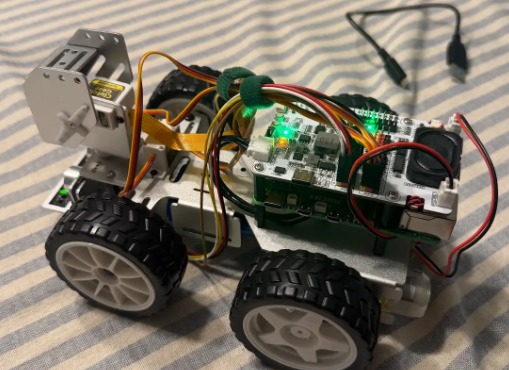
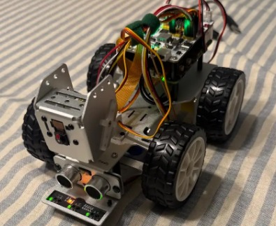
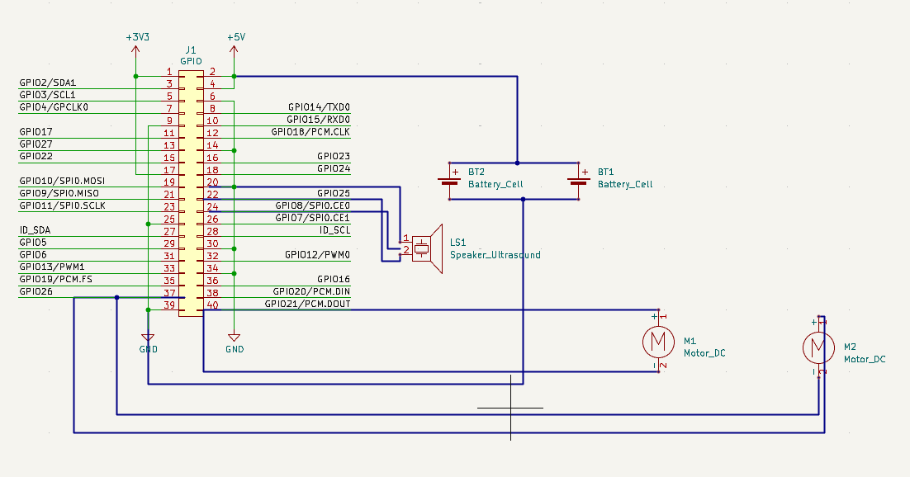

# autonomous-k5

A small self-driving car built on a Raspberry Pi 5 and a SunFounder PiCar-X, for CS 437 (Internet of Things) at UIUC.

Give it a goal in centimeters and it drives there on its own. It maps obstacles with an ultrasonic sensor, plans a route with A*, and uses the camera to stop for stop signs and wait for pedestrians.

<p>
  
  
</p>

## Demos

| Part 1: obstacle avoidance (5 min) | Part 2: mapping, routing and detection (10 min) |
| --- | --- |
| [](https://youtu.be/mbqyk3iWs0k) | [](https://youtu.be/wf1JQzL7fbU) |

## What it does

### Part 1: drive without hitting things

[`part1/avoid.py`](part1/avoid.py) is a Roomba-style loop that only uses the ultrasonic sensor.

1. If nothing is within 50 cm, drive forward.
2. If something is closer than that, pick a random steering angle of at least 20 degrees to one side and steer around it.
3. If the obstacle gets within 15 cm anyway, reverse with the wheels turned the other way, then try again.

The sensor sometimes returns an error value instead of a distance. The car only treats that as "clear" if the previous reading showed plenty of open space.

### Part 2: drive to a goal

[`part2/main.py`](part2/main.py) repeats one loop until the car arrives: scan, update the map, plan a route, drive a few steps.

**Mapping** ([`mapping.py`](part2/mapping.py)). The floor is a 40 x 40 grid of 10 cm cells, so 4 m x 4 m. The car starts at the bottom center. It estimates its own position from how fast it drives and for how long. Each ultrasonic reading is turned into a grid cell with sine and cosine from the car's position and heading. Error readings and anything past 100 cm are ignored. Every obstacle gets one cell of padding, because the car is wider than a cell.

**Routing** ([`planner.py`](part2/planner.py)). A* over the grid with a Manhattan-distance heuristic. Each search state is a cell plus the direction the car is facing, and a 90 degree turn costs as much as three straight cells. Turns are the slowest and least accurate thing the car does, so this keeps routes straight. If there is no route to the goal, the car stops instead of driving in circles.

**Detection** ([`detector.py`](part2/detector.py)). Picamera2 frames at 320 x 240 go through MediaPipe's EfficientDet-Lite0 model, at about 12 to 16 frames per second on the Pi. A stop sign makes the car wait a few seconds, with a cooldown so it doesn't stop for the same sign twice. A person makes it wait until they are out of view.

**Driving** ([`main.py`](part2/main.py)). While it moves, the car checks the ultrasonic sensor every 50 ms. If something is within 20 cm it stops, marks the obstacle on the map, backs up, and plans again.

After every scan the map is printed to the terminal. `#` is an obstacle, `+` is padding, `*` is the planned route, `C` is the car and `G` is the goal. This example comes from running the mapping and planning code against a simulated room:

```
.......******G......................
.......*............................
.......*............................
.......*............................
.......*............................
.......*+++++++.....................
.......*+#+#+#+.....................
.......*+++++++.....................
.......**C..........................
....................................
....................................
....................................
.................+++................
.................+#+................
.................+++................
```

## Problems I ran into

- **The car pulled to one side.** One rear motor ran slower than the other, so the car veered when it should have gone straight. `motors()` in `main.py` applies a separate power trim to each rear motor.
- **Turns are arcs, not pivots.** The car can't turn in place. A 90 degree turn moves it about 20 cm forward and 20 cm sideways, which made it overshoot the goal. The route follower now starts each turn two cells early, and the position estimate accounts for the arc.
- **Padding swallowed the goal.** An obstacle next to the goal would pad over it and make the goal look unreachable. Padding is now removed in the cells right around the goal.
- **A* turned for no reason.** With equal-length routes, A* had nothing to choose between turning first and going straight first. Tracking the heading and charging extra for turns fixed it.
- **The camera has no sense of distance.** A stop sign at the far end of the course is detected from the start line, so the car stops for it early and then again when it gets close.
- **The sensor only looks straight ahead.** The car has to drive toward an obstacle to find it, so it sometimes commits to a route before learning it is blocked.

## What I would change

- Mount the ultrasonic sensor on the pan servo and sweep it, so the map fills in before the car commits to a route. `scan()` already supports this behind `USE_PAN_SCAN`.
- Run detection and the safety check on their own threads, so the car keeps reacting while it plans.
- Estimate how far away a detected object is, for example from the size of its bounding box, and ignore the ones that are too far to matter.

## Hardware

- Raspberry Pi 5
- SunFounder PiCar-X (rear-wheel drive) with the Robot HAT
- Ultrasonic distance sensor, fixed to the front
- Pi camera on the pan/tilt mount
- Grayscale sensor (only used by the test script)



A simplified schematic of the parts used in part 1, drawn in KiCad. The symbol library had no ultrasonic sensor, so a speaker symbol stands in for it.

## Running it

On the Pi, set up the PiCar-X and Robot HAT libraries with [SunFounder's guide](https://docs.sunfounder.com/projects/picar-x/en/latest/), then:

```bash
sudo apt install python3-picamera2
pip install -r requirements.txt
```

Part 1:

```bash
python3 part1/avoid.py
```

Part 2 takes the goal as centimeters to the right and centimeters forward of where the car starts. This drives to a point 50 cm left and 2 m ahead:

```bash
cd part2
python3 main.py -50 200
```

Run it from inside `part2/`, since the detector loads `efficientdet_lite0.tflite` from the current folder.

### Calibration

Every car is a little different. The constants at the top of `part2/main.py` are tuned for mine:

| Constant | What it sets |
| --- | --- |
| `SPEED`, `CM_PER_SEC` | Motor power, and how far the car travels in one second at that power |
| `TURN_ANGLE`, `TURN_90_SEC`, `TURN_RADIUS_CM` | How a 90 degree turn is driven and how much room it takes |
| `LEFT_TRIM`, `RIGHT_TRIM` | Power multiplier for each rear motor, to make the car drive straight |
| `SAFETY_CM`, `BACKUP_CM` | When to stop for an obstacle and how far to reverse |
| `STOP_SIGN_WAIT`, `STOP_SIGN_COOLDOWN` | How long to wait at a stop sign, and how long before another one counts |

## Layout

```
part1/avoid.py              Part 1: obstacle avoidance
part2/main.py               Part 2: the scan, map, plan, drive loop
part2/mapping.py            Grid map built from ultrasonic readings
part2/planner.py            A* with a turn penalty
part2/detector.py           Camera object detection
part2/efficientdet_lite0.tflite   Detection model
tools/test_ultrasonic.py    Print ultrasonic readings
tools/test_grayscale.py     Print grayscale sensor readings
tools/calibrate_steering.py Nudge the steering servo's center offset
docs/                       Photos and the wiring schematic
```
